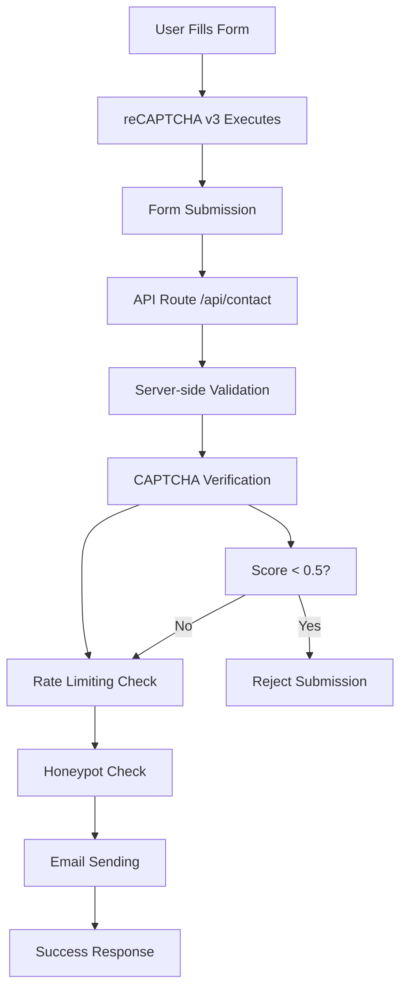

# reCAPTCHA v3 Implementation Documentation

## Table of Contents
1. [Overview](#overview)
2. [Architecture](#architecture)
3. [Google reCAPTCHA Configuration](#google-recaptcha-configuration)
4. [Environment Setup](#environment-setup)
5. [Frontend Implementation](#frontend-implementation)
6. [Backend Implementation](#backend-implementation)
7. [Security Features](#security-features)
8. [Testing](#testing)
9. [Troubleshooting](#troubleshooting)
10. [Performance Considerations](#performance-considerations)
11. [Monitoring and Analytics](#monitoring-and-analytics)

## Overview

This document provides a comprehensive guide to the reCAPTCHA v3 implementation in the Princeton Staffing Solutions contact form. The implementation uses Google reCAPTCHA v3 for invisible bot protection with score-based verification.

### Key Features
- **Invisible Protection**: No user interaction required
- **Score-based Verification**: 0.0 (bot) to 1.0 (human) scoring
- **Server-side Validation**: Secure verification on the backend
- **Fallback Handling**: Graceful degradation when not configured
- **Rate Limiting**: Additional protection against spam
- **Honeypot Fields**: Extra layer of bot detection

## Architecture



### Components
- **Frontend**: React component with reCAPTCHA v3 integration
- **Backend**: Next.js API route with server-side verification
- **Security**: Multiple layers of protection
- **Email**: Resend API for email delivery

## Google reCAPTCHA Configuration

### Step 1: Create reCAPTCHA Site
1. Visit [Google reCAPTCHA Admin Console](https://www.google.com/recaptcha/admin)
2. Sign in with your Google account
3. Click "Create" to register a new site

### Step 2: Site Registration Form

#### **Label** (Required)
```
Princeton Staffing Solutions Contact Form
```

#### **reCAPTCHA Type** (Required)
- Select: **reCAPTCHA v3**

#### **Domains** (Required)
**Development:**
```
localhost
127.0.0.1
```

**Production:**
```
yourdomain.com
www.yourdomain.com
*.yourdomain.com
```

#### **Accept Terms** (Required)
- Check the terms of service checkbox

### Step 3: Get Your Keys
After registration, you'll receive:

#### **Site Key** (Public)
- Format: `6Lxxxxxxxxxxxxxxxxxxxxxxxxxxxxxxxxxxxxxxxxxxxxx`
- Used for: Frontend reCAPTCHA widget
- Environment Variable: `NEXT_PUBLIC_RECAPTCHA_SITE_KEY`

#### **Secret Key** (Private)
- Format: `6Lxxxxxxxxxxxxxxxxxxxxxxxxxxxxxxxxxxxxxxxxxxxxx`
- Used for: Server-side verification
- Environment Variable: `RECAPTCHA_SECRET_KEY`

## Environment Setup

### Required Environment Variables

Create a `.env.local` file:

```env
# reCAPTCHA Configuration
NEXT_PUBLIC_RECAPTCHA_SITE_KEY=6Lxxxxxxxxxxxxxxxxxxxxxxxxxxxxxxxxxxxxxxxxxxxxx
RECAPTCHA_SECRET_KEY=6Lxxxxxxxxxxxxxxxxxxxxxxxxxxxxxxxxxxxxxxxxxxxxx

# Email Configuration
DEST_EMAIL=your-email@domain.com
FROM_EMAIL=onboarding@resend.dev
RESEND_API_KEY=re_xxxxxxxxxxxx

# Optional: Rate Limiting
UPSTASH_REDIS_REST_URL=https://your-redis-url.upstash.io
UPSTASH_REDIS_REST_TOKEN=your-redis-token
```

### Environment Variable Usage

| Variable | Usage | Visibility | Purpose |
|----------|-------|------------|---------|
| `NEXT_PUBLIC_RECAPTCHA_SITE_KEY` | Frontend | Public | reCAPTCHA widget initialization |
| `RECAPTCHA_SECRET_KEY` | Backend | Private | Server-side verification |

## Frontend Implementation

### Dependencies

```json
{
  "react-google-recaptcha-v3": "^1.10.1"
}
```

### Component Structure

```typescript
// ContactForm.tsx
import { GoogleReCaptchaProvider, useGoogleReCaptcha } from 'react-google-recaptcha-v3';

const ContactFormInner = () => {
  const { executeRecaptcha } = useGoogleReCaptcha();
  
  const onSubmit = async (data) => {
    // Execute reCAPTCHA before submission
    if (executeRecaptcha && process.env.NEXT_PUBLIC_RECAPTCHA_SITE_KEY) {
      const token = await executeRecaptcha('contact_form');
      data.captchaToken = token;
    }
    
    // Submit form...
  };
};

const ContactForm = (props) => {
  if (!process.env.NEXT_PUBLIC_RECAPTCHA_SITE_KEY) {
    return <ContactFormInner {...props} />;
  }

  return (
    <GoogleReCaptchaProvider
      reCaptchaKey={process.env.NEXT_PUBLIC_RECAPTCHA_SITE_KEY}
      scriptProps={{
        async: false,
        defer: false,
        appendTo: 'head',
      }}
    >
      <ContactFormInner {...props} />
    </GoogleReCaptchaProvider>
  );
};
```

### Key Features

#### **Invisible Integration**
- No visible CAPTCHA widget
- Automatic execution on form submission
- Seamless user experience

#### **Action Naming**
```typescript
const token = await executeRecaptcha('contact_form');
```
- Helps with analytics and monitoring
- Identifies the specific form action

#### **Fallback Handling**
- Graceful degradation when reCAPTCHA is not configured
- Shows appropriate user messaging

## Backend Implementation

### API Route Structure

```typescript
// app/api/contact/route.ts
import { verifyCaptcha } from '@/lib/security/captcha';

export async function POST(request: NextRequest) {
  // 1. Parse and validate request
  // 2. Check rate limiting
  // 3. Verify CAPTCHA
  // 4. Send email
  // 5. Return response
}
```

### CAPTCHA Verification

```typescript
// lib/security/captcha.ts
export async function verifyCaptcha(token: string): Promise<{
  success: boolean;
  score?: number;
  error?: string;
}> {
  const response = await fetch('https://www.google.com/recaptcha/api/siteverify', {
    method: 'POST',
    headers: { 'Content-Type': 'application/x-www-form-urlencoded' },
    body: new URLSearchParams({
      secret: process.env.RECAPTCHA_SECRET_KEY,
      response: token,
    }),
  });

  const result = await response.json();
  
  // Check score threshold (0.5 recommended)
  const score = result.score || 0;
  const threshold = 0.5;
  
  if (score < threshold) {
    return { success: false, score, error: 'Score too low' };
  }
  
  return { success: true, score };
}
```

### Score Thresholds

| Threshold | Description | Use Case |
|-----------|-------------|----------|
| 0.3 | Very permissive | High traffic, low spam |
| 0.5 | Balanced | **Recommended for contact forms** |
| 0.7 | Strict | High-value forms |
| 0.9 | Very strict | Critical operations |

## Security Features

### Multi-Layer Protection

1. **reCAPTCHA v3 Verification**
   - Score-based bot detection
   - Invisible to users
   - Google's machine learning

2. **Rate Limiting**
   - Prevents rapid submissions
   - IP-based tracking
   - Configurable limits

3. **Honeypot Fields**
   - Hidden form fields
   - Bot detection mechanism
   - Immediate rejection if filled

4. **Form Age Validation**
   - Minimum 3-second delay
   - Prevents instant submissions
   - Human behavior simulation

5. **Input Sanitization**
   - XSS prevention
   - SQL injection protection
   - Data cleaning

### Validation Flow

```typescript
// 1. Client-side validation
const validationResult = contactFormSchema.safeParse(data);

// 2. Server-side validation
const serverValidation = serverContactSchema.safeParse(serverData);

// 3. Rate limiting check
const rateLimitResult = await checkContactFormRateLimit(clientIP);

// 4. Honeypot check
if (data.website && data.website.trim() !== '') {
  return reject('Honeypot triggered');
}

// 5. Form age check
if (data.formAge < 3) {
  return reject('Form submitted too quickly');
}

// 6. CAPTCHA verification
const captchaResult = await verifyCaptcha(data.captchaToken);
```

## Testing

### Local Development Testing

1. **Environment Setup**
   ```bash
   cp env.example .env.local
   # Fill in your reCAPTCHA keys
   ```

2. **Start Development Server**
   ```bash
   npm run dev
   ```

3. **Test Form Submission**
   - Fill out the contact form
   - Submit and check browser console
   - Verify reCAPTCHA execution

### Production Testing

1. **Domain Configuration**
   - Ensure production domain is in reCAPTCHA console
   - Test with actual domain name

2. **Score Monitoring**
   - Check reCAPTCHA admin console
   - Monitor score distribution
   - Adjust threshold if needed

### Test Cases

#### **Valid Submission**
- Fill all required fields
- Wait 3+ seconds
- Submit form
- Should receive success response

#### **Bot-like Behavior**
- Submit form immediately (< 3 seconds)
- Fill honeypot field
- Should be rejected

#### **Low Score**
- Use automated tools
- Should be rejected if score < 0.5

## Troubleshooting

### Common Issues

#### **"Invalid domain" Error**
```
Error: Invalid domain for site key
```
**Solution:**
- Add domain to reCAPTCHA console
- Include both `www` and non-`www` versions
- Add `localhost` for development

#### **"Invalid site key" Error**
```
Error: Invalid site key
```
**Solution:**
- Verify site key format
- Check environment variable loading
- Ensure correct key for domain

#### **"Invalid secret key" Error**
```
Error: Invalid secret key
```
**Solution:**
- Verify secret key matches site key
- Check server-side environment variables
- Ensure key is not exposed client-side

#### **CAPTCHA Not Loading**
```
CAPTCHA not configured
```
**Solution:**
- Check `NEXT_PUBLIC_RECAPTCHA_SITE_KEY`
- Verify environment variable prefix
- Check browser console for errors

### Debug Mode

Enable debug logging:

```env
DEBUG=contact-form:*
```

This will log:
- Form validation details
- CAPTCHA verification results
- Rate limiting status
- Email sending results

### Health Check

Visit `/api/health` to check configuration:

```json
{
  "status": "healthy",
  "timestamp": "2024-01-01T00:00:00.000Z",
  "services": {
    "captcha": true,
    "email": true,
    "rateLimit": false
  }
}
```

## Performance Considerations

### Optimization Strategies

1. **Script Loading**
   ```typescript
   scriptProps={{
     async: false,
     defer: false,
     appendTo: 'head',
   }}
   ```

2. **Lazy Loading**
   - Only load reCAPTCHA when form is visible
   - Conditional provider wrapping

3. **Caching**
   - reCAPTCHA tokens are single-use
   - No caching needed for tokens
   - Cache site key in environment

### Bundle Size Impact

- **react-google-recaptcha-v3**: ~15KB gzipped
- **Google reCAPTCHA script**: ~50KB (cached by Google)
- **Total impact**: ~65KB first load, ~15KB subsequent

## Monitoring and Analytics

### reCAPTCHA Admin Console

Monitor at: https://www.google.com/recaptcha/admin

#### **Key Metrics**
- **Score Distribution**: See how users are scored
- **Domain Performance**: Monitor across domains
- **Error Reports**: View verification failures
- **Suspicious Activity**: Bot detection alerts

#### **Analytics Dashboard**
- Request volume over time
- Score distribution charts
- Error rate monitoring
- Geographic distribution

### Custom Logging

```typescript
// Log successful submissions
console.log('Contact form submission successful:', {
  ip: clientIP,
  email: sanitizedData.email,
  processingTime: `${processingTime}ms`,
  captchaScore: captchaResult.score,
  messageId: emailResult.messageId,
});
```

### Error Monitoring

```typescript
// Log CAPTCHA failures
console.warn('CAPTCHA verification failed:', {
  ip: clientIP,
  error: captchaResult.error,
  score: captchaResult.score,
});
```

## Best Practices

### Security
1. **Never expose secret keys** in client-side code
2. **Use environment variables** for all sensitive data
3. **Implement multiple security layers** (not just CAPTCHA)
4. **Monitor and log** all form submissions
5. **Regular security audits** of the implementation

### Performance
1. **Optimize script loading** for better UX
2. **Monitor bundle size** impact
3. **Use appropriate score thresholds** for your use case
4. **Implement proper error handling** and fallbacks

### Maintenance
1. **Keep dependencies updated** regularly
2. **Monitor reCAPTCHA console** for issues
3. **Test thoroughly** after any changes
4. **Document configuration** for team members

## Conclusion

This reCAPTCHA v3 implementation provides robust bot protection while maintaining a seamless user experience. The multi-layer security approach ensures effective spam prevention while the invisible nature of reCAPTCHA v3 doesn't interrupt legitimate users.

For questions or issues, refer to:
- [Google reCAPTCHA Documentation](https://developers.google.com/recaptcha/docs/v3)
- [react-google-recaptcha-v3 GitHub](https://github.com/t49tran/react-google-recaptcha-v3)
- Internal documentation in `/docs/` directory
